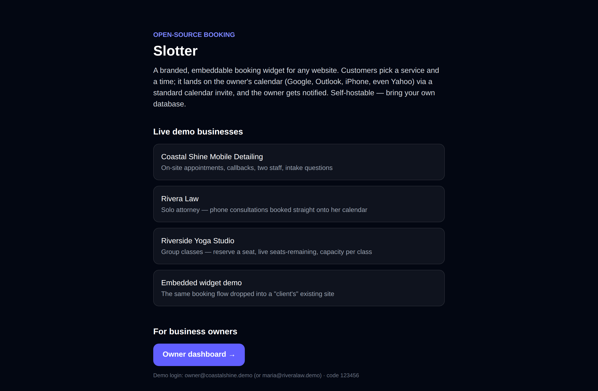
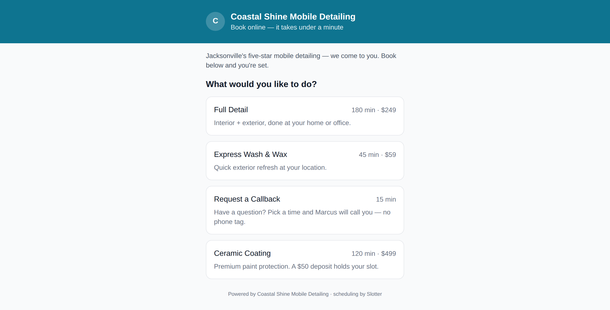
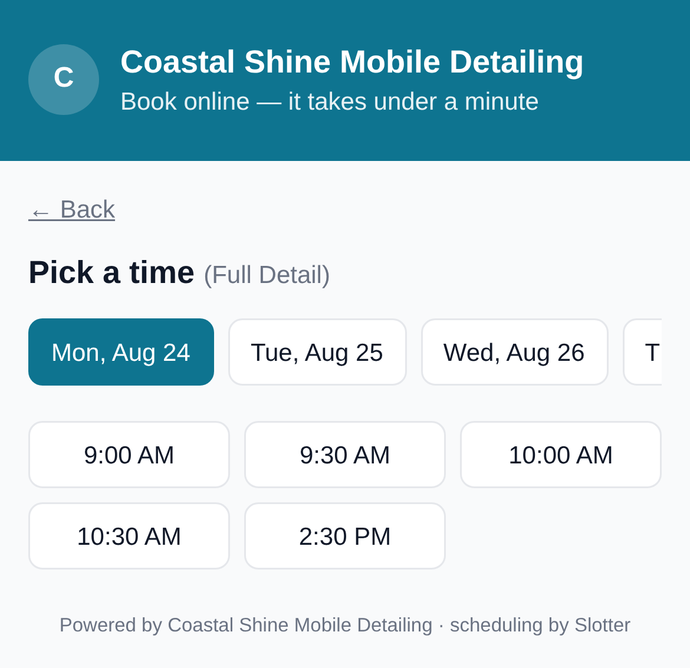
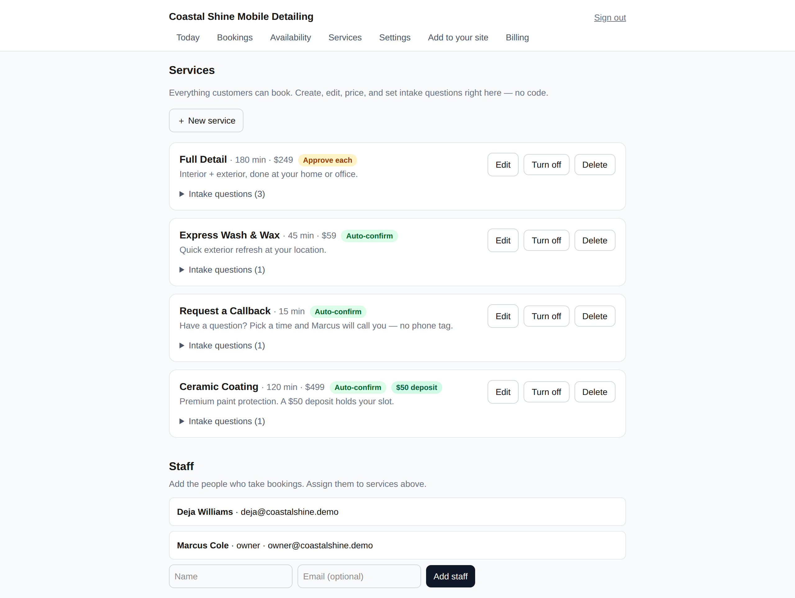
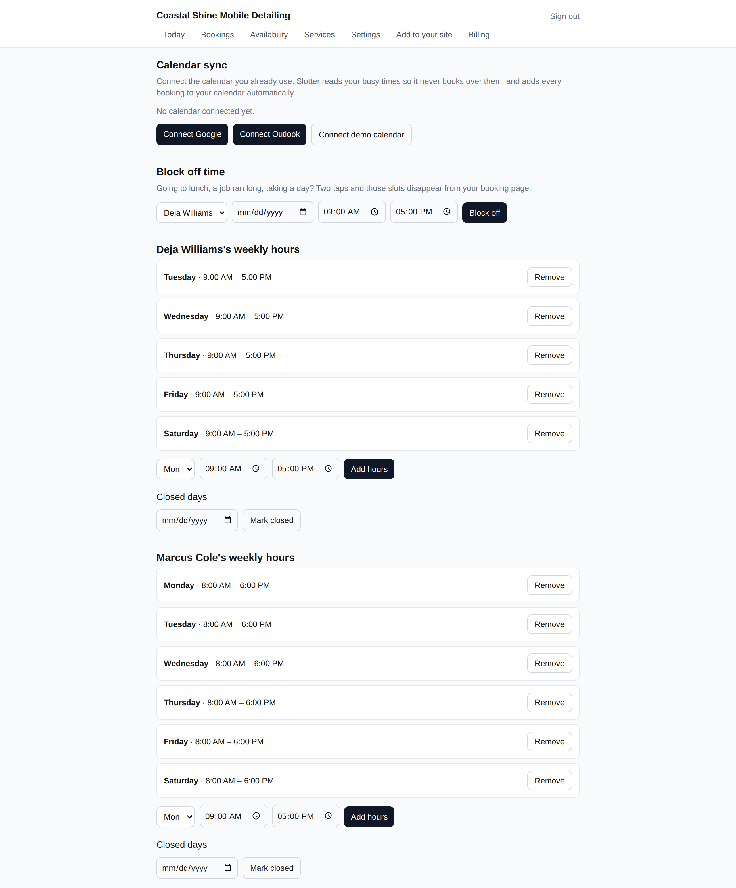
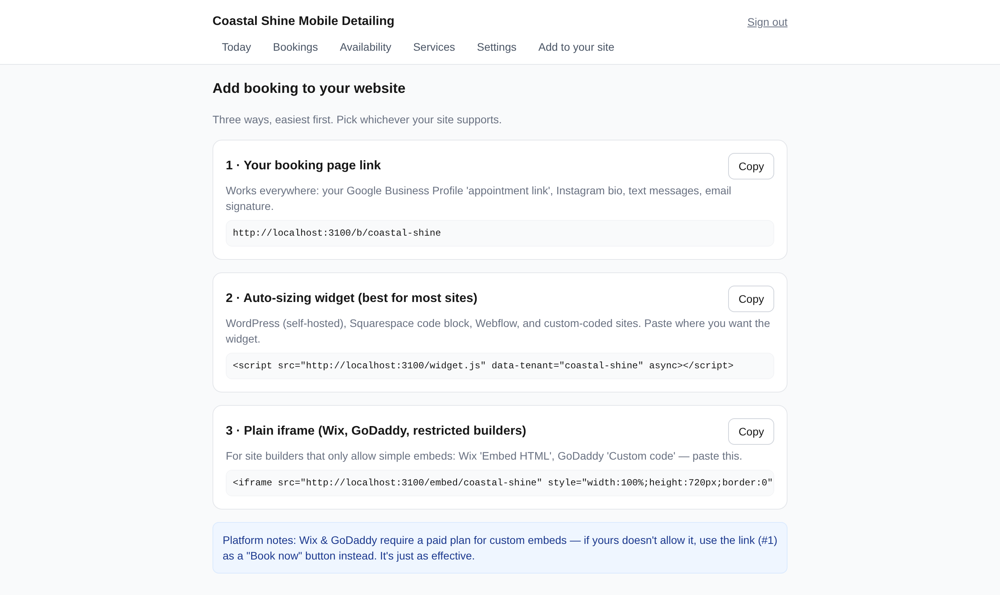
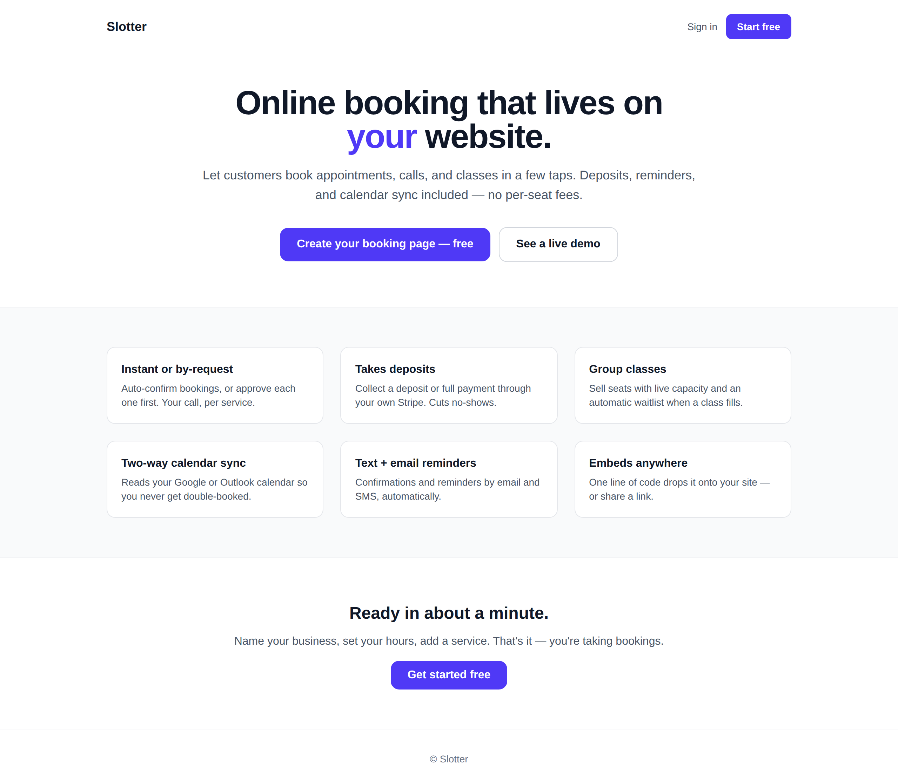

# Slotter

An open-source, embeddable booking widget for any small-business website. Customers pick a service and a time; the appointment lands on the owner's calendar (Google, Outlook, iPhone, even Yahoo) through a standard calendar invite, and the owner gets an email. Drop it onto a site with one `<script>` tag, or link to a hosted booking page.

Self-hostable end to end — bring your own Supabase database, deploy to Vercel (or anywhere Next.js runs), and you own the whole stack. No per-seat SaaS fees, no vendor lock-in.

MIT licensed.


---

## What it does

- **Embeddable three ways** — an auto-resizing `<script>` widget, a plain `<iframe>` for locked-down site builders (Wix, GoDaddy), or a hosted booking-page link you can drop anywhere (Google Business Profile, Instagram bio, email signature).
- **Two-way calendar sync** — connect a Google or Outlook/365 calendar and Slotter reads the owner's busy times so it never books over them, and writes every booking back to their calendar. Apple/iCloud gets one-way delivery via the `.ics` feed. Fully demoable with no accounts. ([docs](./docs/CALENDAR-SYNC.md))
- **Email + SMS** — confirmations and reminders by email (Resend) and text (Twilio), consent-gated. Idempotent, tenant-configurable cadence, one cron endpoint.
- **Multi-tenant** — one deployment serves many businesses, each with its own slug, branding, staff, services, and availability.
- **Self-serve setup** — owners create and edit services (all modes, pricing, deposits, group capacity, intake questions) and manage staff right in the dashboard. No SQL required.
- **Real double-booking protection** — enforced in the database itself (a Postgres exclusion constraint), not just in application code, so two customers can never grab the same slot even under a race.
- **Timezone- and DST-correct** — the slot engine is a set of pure functions with a test suite; nonexistent and ambiguous wall-clock times around DST transitions are handled explicitly.
- **Universal calendar delivery** — every confirmed booking ships a standards-compliant `.ics` invite, so it works with any calendar app without OAuth. Each tenant also gets a subscribable calendar feed.
- **Deposits, full payment & refunds** — collect a deposit or full payment through the tenant's own Stripe; eligible cancellations refund automatically (idempotent). ([docs](./docs/PAYMENTS.md))
- **Waitlists & no-shows** — a full class auto-waitlists; a freed seat promotes the next person automatically. Owners can mark no-shows.
- **Owner dashboard** — passwordless email-code login; manage everything above, approve requests, and see all bookings.

### The four booking modes

| Mode | What it's for | Demo example |
|------|---------------|--------------|
| **V1 · Instant appointment** | Pick a service + open slot, booked immediately | Coastal Shine "Express Wash" |
| **V2 · Request-to-book / callback** | Customer requests; owner approves or declines before it's confirmed | Rivera Law "Paid 60-min consultation" |
| **V3 · Paid deposit** | A deposit (the tenant's own Stripe) is collected before the slot is held | Coastal Shine "Ceramic Coating" ($50) |
| **V4 · Group / class** | Fixed events with capacity and live seats-remaining | Riverside Yoga classes |

All four are already wired into the demo seed — no configuration needed to see them. For a plain-English breakdown of what each mode does, when to reach for it, and exactly how to turn it on, see **[docs/BOOKING-MODES.md](./docs/BOOKING-MODES.md)**.

---

## Screenshots

All from the running demo (`npm run dev`), no configuration needed.

**The customer booking flow** — pick a service, then a time. Mobile-first, works on any site.

| Landing / demo picker | Choose a service | Pick a time |
|---|---|---|
|  |  |  |

**Group classes (V4)** with live seats-remaining, and the flow **on mobile:**

| Group class registration | On mobile |
|---|---|
|  |  |

**The owner dashboard** — passwordless login. Owners create and edit services (every mode, deposits, group capacity, intake questions), set weekly hours, and connect their Google/Outlook calendar for two-way sync.

| Services & staff (self-serve) | Availability + calendar sync | Add to your site |
|---|---|---|
|  |  |  |

**Market edition** ships a self-serve marketing landing and signup; the **agency edition** ships a white-label demo hub instead (one codebase, `SLOTTER_EDITION` flag — see [docs/EDITIONS.md](./docs/EDITIONS.md)).



---

## Tech stack

- **Next.js 15** (App Router, TypeScript, React 19)
- **Supabase** (PostgreSQL) for data + row-level security
- **Vercel** for hosting + cron (any Next.js host works)
- **Resend** for transactional email (prod only)
- **Stripe** for deposits (prod only — each tenant uses their own account)

---

## Documentation

- **[docs/BOOKING-MODES.md](./docs/BOOKING-MODES.md)** — the four booking modes explained: what each does, the businesses it fits, when to use it, and the exact steps (dashboard vs SQL) to enable it.
- **[docs/HOSTING-GUIDE.md](./docs/HOSTING-GUIDE.md)** — the operator's runbook: the host-vs-owner split, onboarding a new business end to end, going from demo to production, day-to-day management, and troubleshooting.
- **[docs/PAYMENTS.md](./docs/PAYMENTS.md)** — production setup for paid deposits/full payment: Stripe keys, the required webhook, refunds, and a go-live checklist.
- **[docs/CALENDAR-SYNC.md](./docs/CALENDAR-SYNC.md)** — two-way Google/Outlook sync: how it works, demo mode, and OAuth setup.
- **[docs/EDITIONS.md](./docs/EDITIONS.md)** — the two editions (agency vs market) and the `SLOTTER_EDITION` flag.
- **[CONTRIBUTING.md](./CONTRIBUTING.md)** — for hacking on the code itself.

New here? Skim this README, click through the demo in **Quick start**, then keep **HOSTING-GUIDE.md** open as you add your first real business.

## Setting up with an AI agent

Using Claude Code, Cursor, Codex, or another AI coding agent? This repo ships an agent playbook:
point your agent at **[`AGENTS.md`](./AGENTS.md)** (Claude Code also reads [`CLAUDE.md`](./CLAUDE.md))
and it has the full wiring guide — provisioning the database, every environment variable, going live,
connecting calendar / SMS / payments, and the specific gotchas that break a setup. Two helper commands
back it up: `npm run setup:check` (validates your env and catches the common mistakes before you
deploy) and `npm run verify -- <url>` (confirms the live app booted and can reach its database).

## Quick start (local, demo mode)

You'll be running in **demo mode**: no email is sent, no real card is charged, and a built-in test checkout page stands in for Stripe. All you need is a free Supabase project.

1. **Clone + install**

   ```bash
   npm install
   ```

2. **Create the database.** In your Supabase project's SQL editor, run `db/schema.sql`, then (optionally, for the three demo businesses) `db/seed.sql`.

   > Before running `schema.sql`, replace `REPLACE_WITH_BH_API_KEY` near the top with a long random string. Use the **same** value for `BH_API_KEY` in your env below.

3. **Configure env**

   ```bash
   cp .env.example .env.local
   ```

   Fill in `SUPABASE_URL`, `SUPABASE_ANON_KEY`, `BH_API_KEY` (must match the schema), and `APP_SECRET`. Leave `APP_MODE=demo`. Then check it: `npm run setup:check`.

4. **Run**

   ```bash
   npm run dev
   ```

   Open <http://localhost:3000>. Try the demo businesses at `/b/coastal-shine`, `/b/rivera-law`, `/b/riverside-yoga`, or sign in at `/dashboard` with `owner@coastalshine.demo` and code **123456**.

---

## Environment reference

| Variable | Required | Purpose |
|----------|----------|---------|
| `APP_MODE` | yes | `demo` (no email/payments) or `prod` (real email + deposits) |
| `SUPABASE_URL` | yes | Supabase project URL |
| `SUPABASE_ANON_KEY` | yes | Supabase anon/public key |
| `BH_API_KEY` | yes | App-key secret gating every DB call; **must equal** the value in `schema.sql` |
| `APP_SECRET` | yes | Signs owner sessions + hashes login codes |
| `NEXT_PUBLIC_BASE_URL` | recommended | Public URL of the app (emails, embeds, calendar links) |
| `ADMIN_EMAILS` | optional | Comma-separated emails allowed into the `/admin` support console |
| `OWNER_NOTICE_BCC` | optional | BCC every owner notification to an ops inbox |
| `NEXT_PUBLIC_APP_NAME` | optional | Product name in UI + email (default `Slotter`) |
| `APP_ICS_DOMAIN` | optional | Domain for calendar UIDs + organizer address (default `slotter.local`) |
| `NEXT_PUBLIC_HIDE_ATTRIBUTION` | optional | `true` hides the small "scheduling by Slotter" footer |
| `CRON_SECRET` | optional | Protects manual calls to the reminder cron |
| `RESEND_API_KEY` | prod only | Resend key for transactional email |
| `MAIL_FROM` | prod only | Verified From address on your domain |

---

## Rebranding

No vendor name is baked into the code — everything routes through `lib/brand.ts`, which reads from env. To make it yours, set `NEXT_PUBLIC_APP_NAME`, `APP_ICS_DOMAIN`, and optionally `NEXT_PUBLIC_HIDE_ATTRIBUTION=true`. No code changes required.

---

## Going to production

1. **Deploy to Vercel** — import the repo, set the environment variables above with `APP_MODE=prod`. `vercel.json` already registers the hourly reminder cron.
2. **Email** — create a [Resend](https://resend.com) account, verify your sending domain, set `RESEND_API_KEY` and `MAIL_FROM`.
3. **Onboard a tenant** — insert a row in `bh_tenants` (slug, name, timezone), add staff, services, and availability rules. The demo seed in `db/seed.sql` is a working template to copy.

### Paid bookings (deposits)

Slotter never touches card data. Each tenant connects their **own** Stripe account, so deposits land directly in that tenant's balance. Setup is a few steps — and one of them (creating the Stripe **webhook**) is easy to miss in a way that silently leaves paid bookings stuck as pending. Follow the full walkthrough and checklist in **[docs/PAYMENTS.md](./docs/PAYMENTS.md)** before enabling real deposits.

---

## Security model

Slotter uses an intentionally simple auth model, and because it's a little unconventional, here's exactly how it works so you can evaluate it before adopting.

The browser talks to Supabase with the **anon (public) key plus a minted `x-bh-key` header secret**. Postgres Row-Level Security is enabled on every table, and every `SECURITY DEFINER` function calls a guard that verifies that header against a secret stored server-side in the `bh_secrets` table. The practical effect:

- **No privileged key ever reaches the browser.** The Supabase service-role key is never shipped to the client (this app doesn't use it at all). A leaked anon key alone can't read or write anything — RLS rejects it without the matching header secret.
- **All writes go through guarded functions.** Bookings, cancellations, approvals, and payments are `SECURITY DEFINER` RPCs that check the guard first, so business rules (capacity, double-booking, status transitions) can't be bypassed by talking to the tables directly.
- **Why this design:** it keeps the whole thing self-hostable on Supabase's free tier with just the anon key, no server-side key management. It was chosen deliberately over the service-role pattern for that portability.

**What to harden for production:** set a strong, unique `BH_API_KEY` and `APP_SECRET` (never the demo placeholders); keep `bh_secrets` locked down (it already has RLS that denies anon/authenticated); serve only over HTTPS so the header isn't observable; and if you run many tenants, consider rotating `BH_API_KEY` periodically. If your deployment would rather use Supabase's service-role key server-side instead, the guard functions are the single place to change.

## Architecture notes

- **Ports and adapters.** Email and payments are interfaces with a `demo` adapter and a `prod` adapter, resolved by `APP_MODE`. Demo mode is fully functional with zero external services — the same code paths, just test implementations.
- **Slot engine.** Availability math lives in `lib/engine/` as pure, unit-tested functions — independent of the database and the framework.
- **Idempotent reminders.** A unique index guarantees one reminder per booking per kind; the cron runner claims each reminder atomically before sending, so it's safe to run at any frequency.
- **Database-enforced correctness.** Double-booking is prevented by a Postgres exclusion constraint, and class capacity by a counted check inside a guarded function — the rules hold even under concurrent requests.

---

## Limitations & roadmap

Being upfront about where the edges are today:

- **Apple/iCloud calendar is one-way.** Google and Outlook/365 sync both ways; iCloud has no OAuth calendar API, so it gets one-way delivery via the subscribable `.ics` feed (bookings land on the calendar, but iCloud busy times aren't read back). CalDAV two-way is on the roadmap.
- **Payments are deposit or full, not a POS.** Slotter collects a deposit or the full price via the tenant's Stripe Checkout and refunds eligible cancellations; it isn't a full point-of-sale or invoicing system.
- **No public hosted demo.** Run `npm run dev` and click through the seeded businesses to evaluate it (about five minutes).
- **Live provider testing needs your keys.** Calendar sync, SMS, and real payments are fully functional in demo mode with no accounts; going live requires your own Google/Microsoft OAuth apps, Twilio, and Stripe (a one-time cutover — see the docs).

Directional roadmap: CalDAV (two-way iCloud), a reconciliation sweep for orphaned calendar events, and richer reporting. Contributions welcome — see `CONTRIBUTING.md`.

---

## Testing

```bash
npm run test          # vitest unit tests (slot engine, etc.)
npx playwright test   # end-to-end flows at mobile width
```

The database tables are prefixed `bh_` for historical reasons — harmless, and left as-is so existing deployments keep working.

---

## Contributing

See [CONTRIBUTING.md](./CONTRIBUTING.md). Issues and pull requests welcome. Please also read the [Code of Conduct](./CODE_OF_CONDUCT.md). To report a security issue privately, see [SECURITY.md](./SECURITY.md). Release history is in [CHANGELOG.md](./CHANGELOG.md).

## License

[MIT](./LICENSE) © 2026 Ryan Warren
